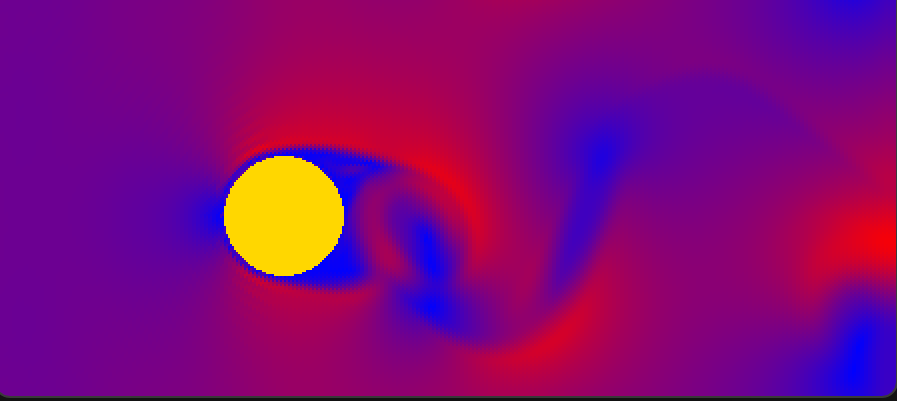

# balance-it

 Balance It! A Python game for CFD

## Run

```
python main.py
```

## Effect

Adjust the Renolds number and see the effect.

Roughly speaking, the higher the Renolds number, the more turbulent the flow is.



The above takes about 60 seconds to emerge, which is a Carmen vortex street.

## Acknowledgements

This is the final project of the track "Computational Fluid Dynamics" in 0-1 Winter Camp 2024, Shenzhen.

## Others

The code is written in Python 3.8.16, and the following packages are required:

- numpy
- pygame

**DO NOT** let the initial velocity (constants.WIND_VELOCITY_X) be too large, or the simulation will not be able to converge.

If you have any questions or improvements regarding the code, please feel free to submit an issue or pull request.